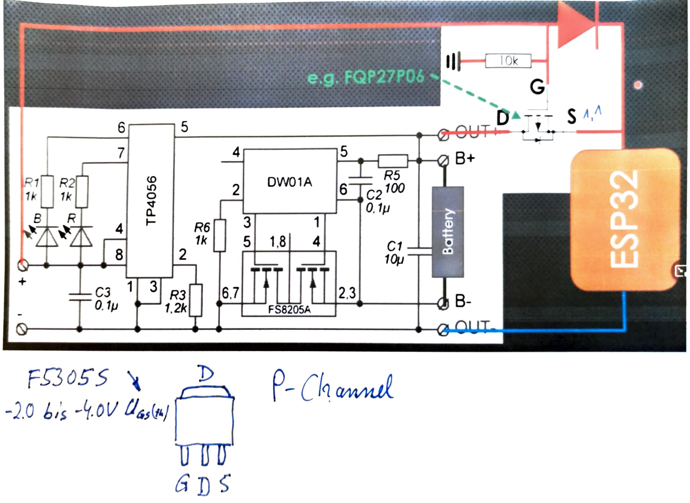

# Esp32LoraBoard
ESP32 board including Lora RFM95 module optimized for low power deep sleep operation. 

## Features:
* works with single LiFePo battery
* external peripheral (i2c bus, Oled, measurement resistors) can be switxched off by FET transistors
* Open Source. Feel free to modify in KiCad and create your own boards
* I2C bus is decoubled be levelshifters
* optional power supply circuit (solder if you don't want do use LiFePo battery supply)
* optional Rotary Encoder 
* there is no UART chip (like CP2104) onboard in order to save power. Board can be programmed by using a simple external USB-to-UART converter (5 Pins: Ground, RX, TX RTS, DTR)

[PCB](../master/kicad/images_V1.1/Esp32LoraBoard_Kicad_PCB_V1.1.png)

### Power consumption

#### Power on and idle 

After PowerOn without sending any Lora data

| Mode              | Current usage |
| ----------------- |:-------------:|
| Normal operation  | 28 mA         |

#### Deep Sleep 

Switched off all peripheral components and shutdown the RFM95W lora chip.

| Mode              | Current usage |
| ----------------- |:-------------:|
| Deep Sleep        | 26 uA         |

### Get Started

* Clone this project and open in platformio.

* Clone ttn-esp32 into lib subdir. Switch to branch dev to get it running. More info see https://github.com/manuelbl/ttn-esp32

* Following has to be changed under in ./lib/ttn-esp32 
Change following:

__src/lmic/config.h__
#define USE_ORIGINAL_AES

__src/aes/lmic_aes.c__
line 263:  u4_t t0, t1=0, t2, t3;

## Erweiterung mit Solarzelle

 Video dazu von Andreas Spiess: [Günstige und einfache Solarenergie für unsere kleinen Projekte](https://www.youtube.com/watch?v=37kGva3NW8w&t=718s)

siehe auch Ordner "documentation":

Spannung am LiPo-Akku: 4.13 Volt

| Beschreibung | Spannung am Solarpannel [V] | Gate-Source Spannung (=Udiode) [V] | Drain-Source Spannung [V] | Spannung am ESP-Board [V] | Spannung am ESP-Board [V] | Erklärung |
| ------ | --------- | ------ | --------- | --------- | --------- | --------- |
| dunkel - Sonne scheint nicht | 1.4 | 2.7 | 0.0 | 4.1 | FET ist durchgeschaltet (Ugs=2.7 V). Der Akku versorgt das Board. Das Solarpanel hat keine Auswirkung. |
| Minimale Sonneneinstrahlung. FET- beginnt zu sperren | 2.3 | 1.8 | 0.0 |  4.1 | FET ist gerade noch leitend. Die Solarspannung reicht noch nicht zur Versorgung von Akku und Board. Board wird durch Akku versorgt. |
| Etwas Sonneneinstrahlung. FET- ist teilweise gesperrt | 3.0 | 0.85 | 0.28 | 3.85 |  FET ist teilweise leitend. Die Solarspannung reicht noch nicht zur Versorgung von Akku und Board. Board wird (nicht optimal) durch Akku versorgt, da am FET 0.6V abfallen. |
|  | 3.6 | 0.06 | 0.46 | 3.66 | |
|  | 3.8 | -0.1 | 0.45 | 3.66 | |
|  | 4.0 | -0.1 | 0.27 | 3.84 | |
| Sonne scheint | 5.0 | -0.1 | 0.6 | 4.72 | Akku wird geladen |
| Sonne scheint hell | 6.0 | -0.1 | 1.7 | 5.84 | Akku wird geladen |

* Die Diodenspannung is auch gleich der Ugs, aber in umgepolter Richtung. D.h. wenn der FET leitet, sperrt die Diode. Wenn die Diode leitet (PowerPath) sperrt der FET
* Es gilt immer: Uesp = Usolar + Ugs   
* Es gilt immer: Ubatt = Uds + Uesp   

